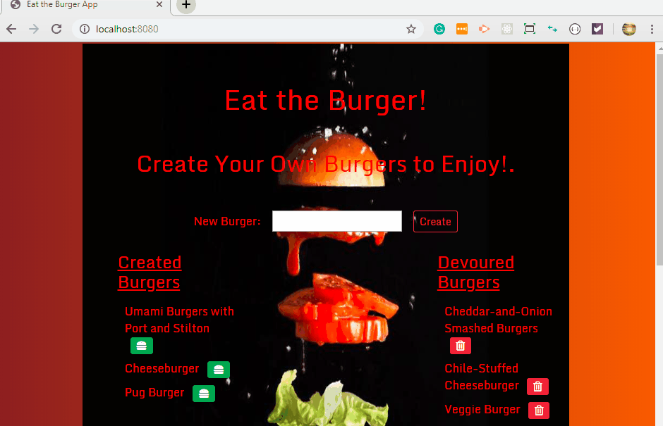

# **EatDaBurger**

## About
* Eat-Da-Burger! is a restaurant app that lets users input the names of burgers they'd like to eat.
* Whenever a user `Creates` a burger's name, the app will display the burger on the left side of the page waiting to be devoured.
* Each burger in the waiting area also has a `Devour it!` button. When the user clicks it, the burger will move to the right side of the page.
* The app stores every burger in `MySQL database`, whether devoured or not.
---

## Links to Github, Heroku Live Demo 
_
_[Github](https://github.com/Razinali/EatDaBurger).
_[Heroku](https://glacial-hollows-37390.herokuapp.com/).
---

## User Instructions
1. Be sure to clone the git project.
2. Run npm install from the console to make sure you get all the        required dependencies
3. Add add the following to your root directory .env file:
    ```
    Sever Connection
    ..SERVER_USER = 'your_mysql_user_name_here'
    ..SERVER_SECRET = 'your_mysql_password_here'
    ```
4. Install the following:

    **_MySQL NPM Package**
    * [MySQL NPM Package](https://www.npmjs.com/package/mysql)

    **MySQL Workbench Documentation**
    * [MySQL Workbench Documentation](http://dev.mysql.com/doc/workbench/en/)

    **MySQL Workbench Installation**
    * [MySQL Workbench Installation](https://dev.mysql.com/downloads/workbench/)

5. From the command line run ``node server.js``

6. Application is set to run on PORT 8080. Launch a browser using the URL localhost:8080

---

## Technologies Used:
* MySQL Workbench
* nodeJS
* JavaScript
* Express
* Handlebars
* A homemade ORM

## Hope You Enjoyed Creating & Devouring Your Burger!

